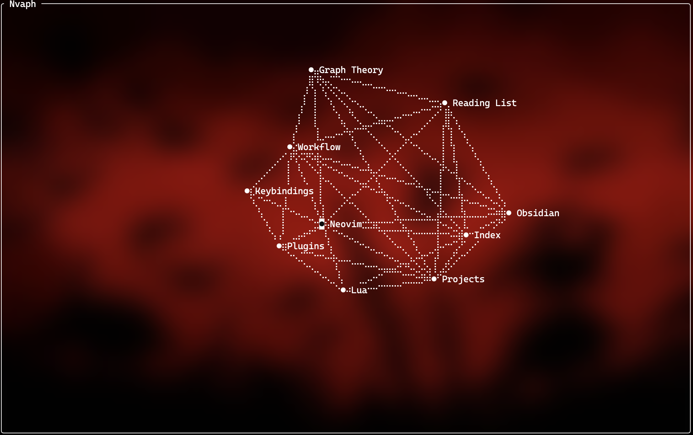

# nvaph

```text
                    ..
     .@@@.        .@@@@
     *@@@@%     .%@@@@@.
    .@@@@@@@@@@@@@@@@@@%
   .@@@@@@@@@@@@@@@@@@@*    | nvaph
  .@@@@@@@@@@@@@@@@@@@@@
  %@@@@@@@@@@@@@@@@@@@@@@
 .@@@*%%%%%*@@@@%%%%%@@@@%  | A simple Obsidian-inspired graph
 %@@@.......%@@%.......@@%  | view for Neovim.
 %@@..%@@@*..@@..%@@*..%@%
 .@@@..%*...*@@...%@...%@%
 .%@@%......@@@%.......@@.
  .%@@@@@@@@@@@@@@*@@@@@%
     %@@@@@@@@@@@@@@@@.
      .%@@@@@@@@%%%%.
```

## Description 

A graph view for Neovim inspired by Obsidian's graph.

Nvaph looks at the wikilinks(e.g. `[[link_to_another_file]]`) in your project and draws them as a graph in a Neovim buffer. The drawing is plain text with ASCII and
Braille characters so it looks the same everywhere without needing special
terminals like Kitty.



## Installation

Nvaph is a plain directory of Lua files. Put it somewhere on your
`runtimepath` and it loads itself. There is nothing to build and no `setup()`
call to make.

With a local checkout, add this early in your config before plugins load:

```lua
vim.opt.runtimepath:prepend('/path/to/nvaph')
```

With lazy.nvim, point it at the directory:

```lua
{ dir = '/path/to/nvaph' }
```

## Usage

Open a file in your project and run:

```
:GraphView
```

You can also pass a directory, which is useful when the buffer you are in does
not belong to the project you want to look at:

```
:GraphView ~/code/someproject
```

The graph opens in a floating window in the middle of the screen. Close it
with `q`.

### Keys

| key | action |
| --- | --- |
| `h` `j` `k` `l` or arrows | move around |
| `CR` | open the file under the cursor |
| `Tab` / `S-Tab` | cycle through files |
| `/` | search by name |
| `r` | run the layout again |
| `F` | fit the graph to the window |
| `+` `-` | zoom |
| `?` | show the key hint |
| `q` or `Esc` | close the graph |

You can also drag a node with the mouse to move it somewhere nicer. It stays
where you put it until you close the graph.

### What ends up in the graph

Nvaph finds the project root by looking for `.git`, `Cargo.toml`,
`package.json`, `pyproject.toml`, `go.mod`, or `Makefile`, starting from the
current file and walking up. If the file you are in has no project marker
above it, the containing directory is used and only its immediate children are
read.

Links are picked up from Markdown and other plain-text formats: `.md`,
`.mdx`, `.txt`, `.org`, `.rst`, `.adoc`, `.tex`, and `.typ`. Both
`[[target]]` and `[label](target.md)` work, along with `![[embeds]]`,
`|aliases`, and `#heading` fragments. Links inside code fences and inline code
are ignored.

Every file in the project can be a node, not just Markdown so
`[[src/main.rs]]` from a notes file works. Those other files are
nodes but are not searched for links of their own unless you turn that on.

By default you see the files that have at least one resolved link. Broken
links and unrelated files stay out of the way.

## Configuration

Everything has a default so you only need this if you want to change
something:

```lua
require('nvaph').setup({
  root = '/path/to/project',  -- set this to skip root detection
  max_files = 20000,         -- stop walking past this many files
  ignore = { '.git', 'node_modules', 'target' },
})
```

The graph is tuned under `graph`:

```lua
require('nvaph').setup({
  graph = {
    max_nodes = 500,
    show_unresolved = false,  -- show links that point at missing files
    animate = true,
    window = { width = 0.85, height = 0.85, border = 'rounded' },
  },
  links = {
    scan_all_files = false,   -- read every file for links, not just text ones
    link_extensions = { '.md', '.txt', '.org' },
  },
})
```

The index is cached on disk under `stdpath('cache')`, so reopening the graph on
a large project is quick. Opening or writing any file inside the project
invalidates it, since Nvaph cannot see changes made outside the editor.

## Completion

If you use nvim-cmp, Nvaph can complete `[[` targets from the same index:

```lua
require('cmp').setup({
  sources = {
    require('nvaph.completion').cmp_source(),
  },
})
```

> [!NOTE]
> This is AI assisted as I am primarily a Zig dev.
> I will still maintain it and feel free to contribute.

## License

MIT © 2026 Skoshic. See [LICENSE](LICENSE) for details.


